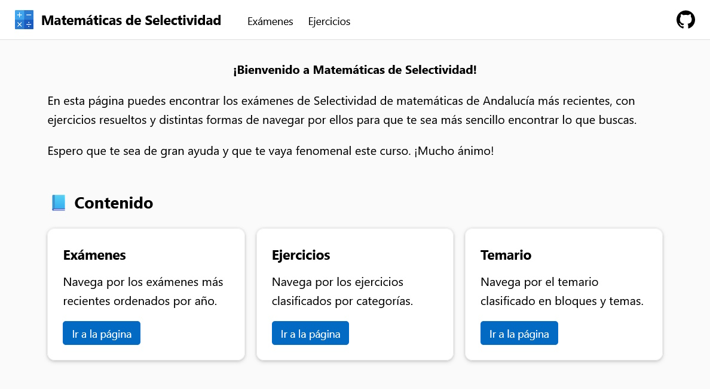

# Matemáticas de Selectividad

Matemáticas de Selectividad es una página web para ver los exámenes de Selectividad de matemáticas de Andalucía, navegar por los ejercicios de forma sencilla, revisar sus resoluciones y explorar el temario del curso.

Los principales objetivos son los siguientes.

- 🔍 Navegación intuitiva y rápida.
- 📱 Adaptabilidad a dispositivos móviles.
- ⌚ Tiempos de carga reducidos.
- 💰 Gratis y libre de anuncios.

La página hace uso de [MathJax](https://www.mathjax.org/) para mostrar los ejercicios directamente en el navegador.
Los exámenes están ordenados por año y los ejercicios están clasificados por categorías.

El diseño está inspirado en [Fluent Design](https://fluent2.microsoft.design), el lenguaje de diseño utilizado por Microsoft en Windows.

## ✉️ Contribuir

### Reportar errores
Para reportar un error, crea una [propuesta](https://github.com/DanielSevillano/matematicas-selectividad/issues).

- ✒️ Erratas en los ejercicios, las resoluciones y el temario.
- ❌ Errores en las resoluciones y el temario.
- 🏷️ Categorías incorrectas.

### Proponer nuevas ideas
Para proponer una idea, crea una [propuesta](https://github.com/DanielSevillano/matematicas-selectividad/issues).

- ➕ Nuevas categorías.
- 🚀 Nuevas funcionalidades.

## 📋 Progreso

### Exámenes
- [x] 2023 a 2012

### Ejercicios resueltos
- [ ] 2023
    - [x] Junio
    - [ ] Julio (3, 6)
    - [ ] Reserva 1 (2, 3)
    - [ ] Reserva 3 (2, 4)
    - [ ] Reserva 4 (1, 3)
- [ ] 2022
    - [ ] Junio (1, 4, 5, 6 y 8)
    - [x] Julio
    - [ ] Reserva 1 (3)
    - [ ] Reserva 2 (3, 4)
    - [ ] Reserva 3 (1, 4)
    - [ ] Reserva 4 (2)
- [ ] 2021
    - [ ] Junio (1, 4)
    - [ ] Julio (1)
    - [ ] Reserva 1 (5)
    - [ ] Reserva 2 (1)
    - [ ] Reserva 3 (6)
- [ ] 2020
    - [ ] Reserva 1 (1)
    - [ ] Reserva 2 (1, 7)
- [ ] 2019
    - [ ] Reserva 1 (A1)
    - [ ] Reserva 3 (B2)