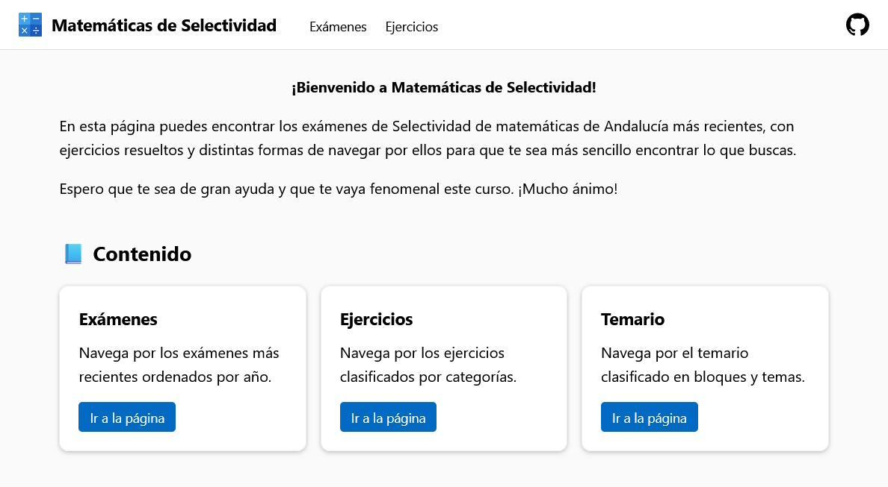

# Matemáticas de Selectividad

Matemáticas de Selectividad es una página web para ver los exámenes de Selectividad de matemáticas de Andalucía, navegar por los ejercicios de forma sencilla, revisar sus resoluciones y explorar el temario del curso.
También cuenta con contenido adicional, como ejercicios diarios y un generador de exámenes.

Los principales objetivos son los siguientes.

- 🔍 Navegación intuitiva y rápida.
- 📱 Adaptabilidad a dispositivos móviles.
- ⌚ Tiempos de carga reducidos.
- 💰 Gratis y libre de anuncios.

La página hace uso de [MathJax](https://www.mathjax.org/) para mostrar los ejercicios directamente en el navegador y de [Chart.js](https://www.chartjs.org/) para las gráficas de las estadísticas.
Los exámenes están ordenados por año y los ejercicios están clasificados por categorías.

El diseño está inspirado en [Fluent Design](https://fluent2.microsoft.design), el lenguaje de diseño utilizado por Microsoft en Windows.

## ✉️ Contribuir

### Reportar errores
Para reportar un error, crea una [propuesta](https://github.com/DanielSevillano/matematicas-selectividad/issues) o una [solicitud de cambio](https://github.com/DanielSevillano/matematicas-selectividad/pulls).

- ✒️ Erratas en los ejercicios, las resoluciones y el temario.
- ❌ Errores en las resoluciones y el temario.
- 🏷️ Categorías incorrectas.

### Proponer nuevas ideas
Para proponer una idea, crea una [propuesta](https://github.com/DanielSevillano/matematicas-selectividad/issues).

- ➕ Nuevas categorías.
- 🚀 Nuevas funcionalidades.

## 📋 Progreso

### Exámenes de ciencias
- [ ] 2026
    - [x] Junio
- [x] 2025 a 2011
- [ ] 2010
    - [x] Junio
    - [x] Septiembre

### Exámenes de sociales
- [ ] 2026
    - [x] Junio
- [x] 2025 a 2011
- [ ] 2010
    - [x] Junio
    - [x] Septiembre

### Ejercicios resueltos de ciencias
- [ ] 2025
    - [x] Junio y julio
    - [x] Reserva 1
    - [ ] Reservas 2 a 4
    - [ ] Modelo de prueba (1 a 10)
- [x] 2024 a 2021
- [ ] 2020
    - [x] Julio y septiembre
    - [x] Reservas 1 y 2
    - [ ] Reserva 3
    - [ ] Reserva 4 (1, 2, 5, 6)
- [ ] 2019
    - [ ] Junio (A1, A2, A3, B1, B4)
    - [ ] Septiembre (A4, B3, B4)
    - [ ] Reserva 1 (A1)
    - [ ] Reserva 2 (A3, B1, B3)
    - [ ] Reserva 3 (B2)
    - [ ] Reserva 4

### Ejercicios resueltos de sociales
- [ ] 2026
    - [] Junio (1, 4, 5)
- [ ] 2025
    - [x] Junio y julio
    - [ ] Reservas 1 a 4
- [x] 2024 a 2022
- [ ] 2021
    - [x] Junio y julio
    - [x] Reservas 1 a 3
    - [ ] Reserva 4 (5)